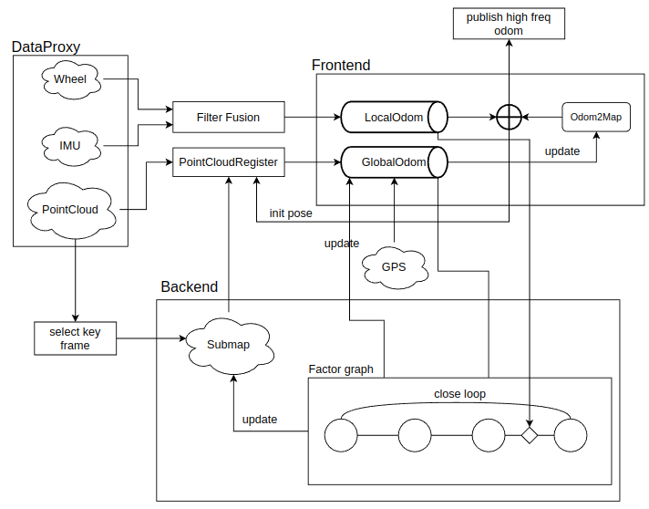
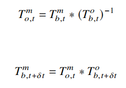
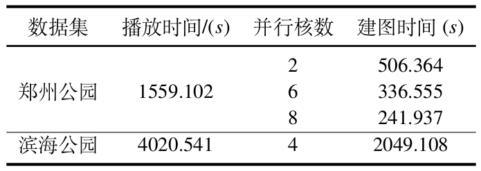
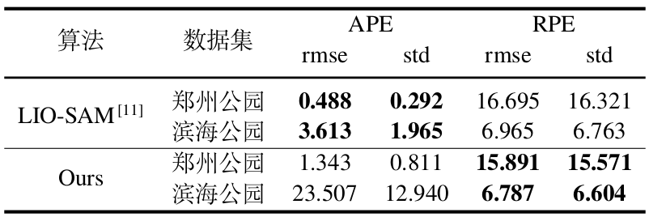
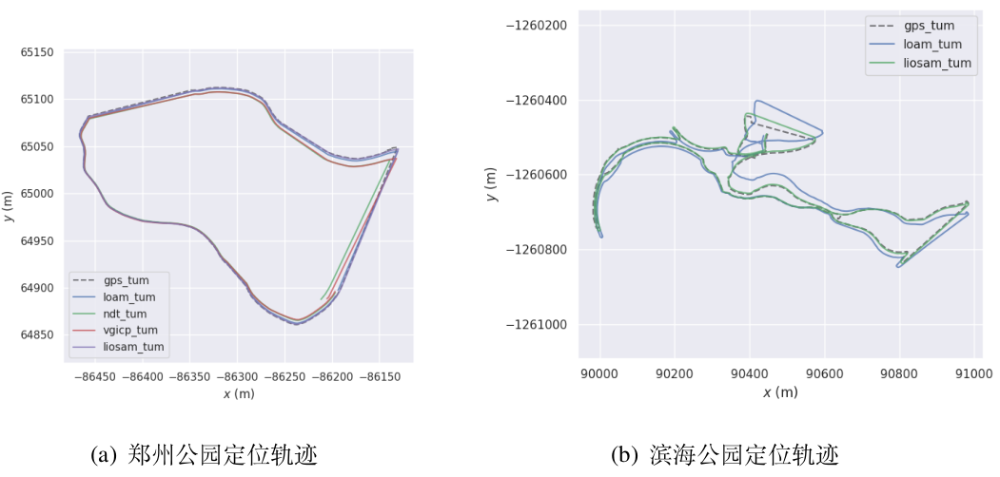

## SimpleSLAM

A lidar-centric simple slam integrated with sensors like imu and wheel odometer, with lots of interfaces for easily re-developing

### Modules

* dataproxy

data interface compatible with various comm protocols. Adapt to another data is easy, you should inherit Base class *DataProxy*, which is templated and ensure thread-safty with block queue(see `common/utils/SafeDeque.hpp`)

* frontend

SLAM frontend providing real-time odometry. Our frontend module is not depend on backend. Frontend is testable individually as locating mode(see unit test: `test/loc.cpp`). Our frontend is lidar-centric, Lidar odometry is the most important part applying the key algorthm of loose-coupled schem.

* PCR(PointCloudRegister)

Frontend heavily depends on PCR. PCR abstract common interface of lidar register and adapt with some mature lidar register algorithms. LOAM-like pc register implemented by [1] is reimplemented with Lie-group update schem. More good algorithms like Ndt[2], Vgicp[3] are available.

* filter

Filter module serves to provide locally accurate odometry like fusion of dead-reckoning, imu or wheel encoder. Extendtable light-weight header-only Kalman library[4] is included. Current version is just simple fusion of wheel, imu and static model. 2D case performance is totally the same as [5].(see test for comparison: `filter/test`)

* backend

SLAM backend for optimization stuff. Backend depends on frontend, which sends keyframe to it. Then pose graph is constructed and optimize all keyframe pose based on gtsam library[6]. Loop closure detection is also included. I want to treat Loop closure detect as Place Recognition problem for scalerable application. So one Keyframe should be able to convert to generalizable context(or say descriptor). Place Recognition problem is just querying context from context database. If you want to use your own context, inherit *ContextBase*(see `backend/include`). For now, context based on 2D-distance and ScanContext[7] is implemented.

* unit test

There are lots of unit test to check each modules working properly. Some are listed below:

1. `benchmark/kdtree.cpp` some benchmark showing efficiency of kdtree implement by PCL or Nanoflann[8].
2. `benchmark/rospub.cpp` showing that the time consumeing of publishing ros message which is not subscribed or is subscibed. They are different.
3. `comp/liorf_scan2map.cpp` compare my Lie-group update LOAM register with original Euler-angle update LOAM[9] register  
4. `dataproxy.cpp` test worker-consumer case with blocked or non-blocked deque.
5. `lcm.cpp` test Loop Closure Manager function with visualization.
6. `logger.cpp` test logger and progress bar.
7. `thread.cpp` test resident thread which means the thread's life extend utils whole program exit.
8. `loc.cpp` minimal lidar odometry case, if you has static pointcloud maps, you can test localization performance with mouse relocalization on rviz.

* app

The main entry of the project! It depends on configuration file at `config/params.json`.

* common

The project contains many practical tools at `common`.
1. geometry: matrix calculations, angle or pose translation, basic manifolds calculations.
2. pcp: pointcloud preprocesser.
3. time: time counter intergrate with spdlog[10].
4. types: basic types alias used in project.
5. utils: singleton logger, blocked or non-blocked queue, compatible share ptr between std and boost, file operation etc.

### Framework



* loose-coupled update schem



m means map frame, o means odom frame, t means time stamp.


### Features

1. Non ROS except `dataproxy`.
2. Support parsing rosbag directly, very fast mapping offline without multi-core CPU.
3. Change pointcloud register method via config file.
4. Automatically switch to mapping or localization mode.
5. Support factor graph reload for remapping.
6. Support designing your own pointcloud descriptor or even visual descriptor.
7. Save all keyframe and ensure keyframe insertion is sparse.

### Config

```json
{
    // mode has lio or lo
    "mode": "lio",
    // speed up pointcloud register
    "cores": 4,
    // use ndt maybe no need to downsample, or sample rate should be small
    "downSampleVoxelGridSize": 0.5, 
    // use for pure location mode for unit test loc.cpp
    "pcd_file": "/home/gy/.robot/data/maps/hqc/hqc.pcd",
    // save map location
    "saveMapDir" : "/home/rick/pcr/test/data/map",
    // rosbag location
    "rosbag": "/media/gy/201E-43FF/binhai_gps0711-0706.bag",
    "tf":{
        // distance from ground use for ScanContext 
        "lidar_height": 2.0
    },

    "dataproxy": {
        // topic name
        "lidar": "/lidar_points",
        "lidar_size": 10,
        "imu": "/imu/data",
        "wheel": "/odom/raw"
    },

    // visualization stuff
    "vis": {
        "enable" : true,
        "align": "/aligned",
        "submap": "/globalmap"
    },
    "backend" : {
        // loop closure parameters
        "lc": {
            "enable" : false,
            "contextDownSampleGridSize" : 0.5,
            "historySubmapRange" : 1,
            "fitnessThreshold" : 0.3
        },
        "context": {
            "scancontext":{
                "numExcludeRecent" : 40,
                "buildTreeGap": 10,
                "numCandidatesFromTree" : 10,
                "searchRatio": 0.1,
                "scDistThres": 0.4
            }
        }
    },
    "frontend" : {
        "pcr" : "loam",     // loam, ndt or vgicp
        // queue size for global odometry or local odometry
        "local_size": 100,
        "global_size": 10
    }
}
```

### Usage

1. Build

```bash
# build under real-time mode
bash build.sh 
# build under rosbag mode
bash build.sh rosbag
# rebuild project
bash build.sh rebuild
```

2. Run

```bash
# rviz means launch rviz
# rebuild means rebuild whole map, factor graph will be deleted
bash run.sh <rviz> <rebuild>

# if you use rosbag, play it then.
```

3. Memory check using Valgrind

Before memory check, you need to install valgrind first.

```bash
bash memcheck.sh
```

### Perf.

1. Fast rosbag parsing offline mapping



2. Precision

No loop closure case, LIO-SAM is better for now.



3. Trajectory



### Ref.

[1] https://github.com/TixiaoShan/LIO-SAM

[2] https://github.com/koide3/ndt_omp

[3] https://github.com/SMRT-AIST/fast_gicp

[4] https://github.com/mherb/kalman

[5] http://wiki.ros.org/robot_pose_ekf

[6] https://github.com/borglab/gtsam

[7] https://github.com/irapkaist/scancontext

[8] https://github.com/jlblancoc/nanoflann

[9] https://github.com/YJZLuckyBoy/liorf

[10] https://github.com/gabime/spdlog